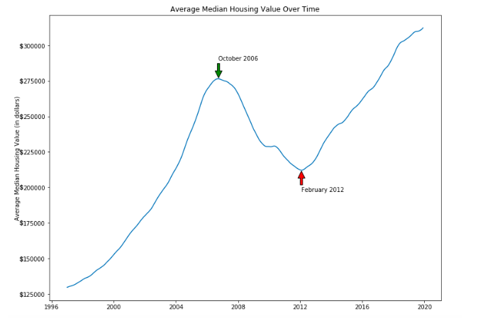
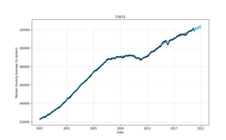
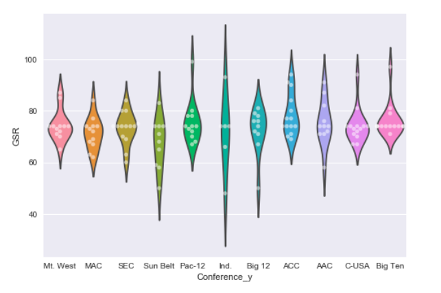
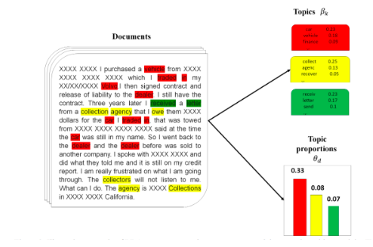
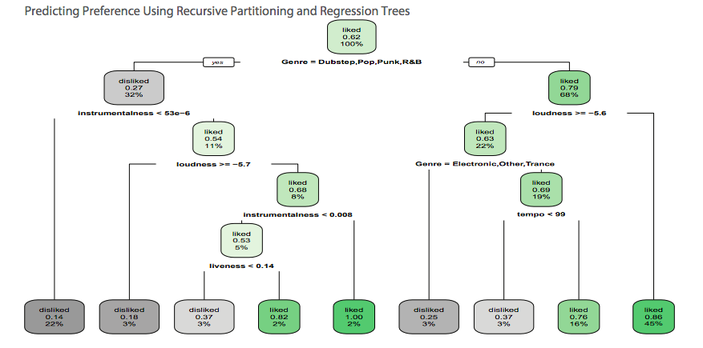
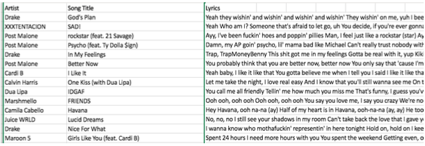
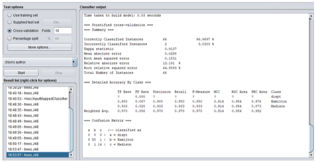
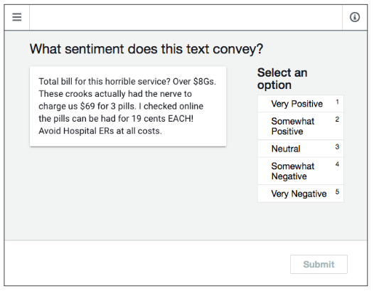

# DataScience
Projects demonstrating skill and expertise in Data Science:  modeling predictions, forecasting, classification 

## Table of contents

### Multi Digit Recognition of Google Street View Housing Data 
*Google, Big Data, Image Recognition, Python, Neural Networks, CNN, MNB, Decision Trees*

http://ufldl.stanford.edu/housenumbers/
  
 

### Forecasting Ideal Zip Codes for Property Investment
*Text mining, feature extraction/creation, Facebook's Prophet, Time Series, R, ggplot, Python*

 

### Predicting Collegiate Football Coach Salaries
*Text mining, data cleaning/standardization/aggregation, visualization, Python*

### MNIST Image Recognition
*Keras Sequential, Multinomial Naive Bayes, Decision Trees, Confusion Matrix*

 

### Topic Modeling 
*Latent Derichlet Allocation, document corpus*

 Topic Modeling of the CFPB Consumer Complaints (Bastani et al, 2018)

### Predicting Spotify Song Preference 
*R, Visualization, Adobe Illustrator, Recursive Partitioning*

### Predicting Genre from Song Lyrics (Spotify) 
*Classification: Naive Bayes, Support Vector Classification, Latent Dirichlet Classification*

### Hamilton VS Madison (Disputed Authorship of Federalist Papers) 
*Weka, Decision Trees*

### Yelp Sentiment Analysis
*Amazon Mechanical Turk, Human annotation, Label resolution, Cohen's Kappa*

